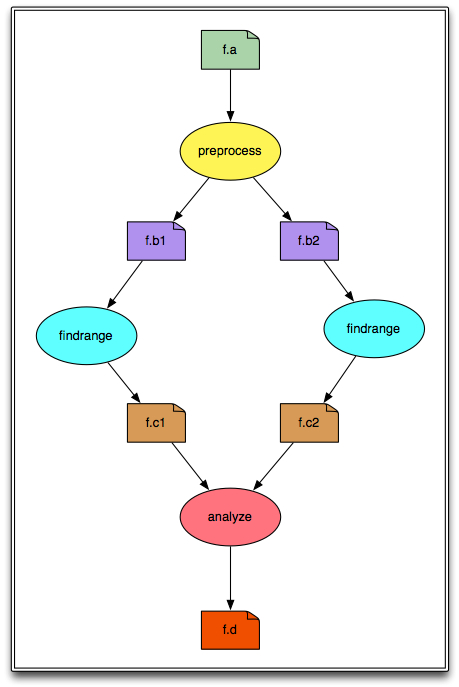
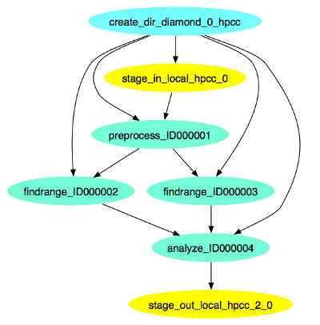

**Based on material by Karan Vahi and Gideon Juve**

## Introduction
Use a browser to open the tutorial on github, located at:
    http://github.com/{{page.github_username}}/{{page.bootcamp_slug}}

This tutorial will take you through the steps of creating and running
a simple workflow using Pegasus. This tutorial is intended for new
users who want to get a quick overview of Pegasus concepts and
usage. The tutorial covers the creating, planning, submitting,
monitoring, debugging, and generating statistics for a simple
diamond-shaped workflow. More information about the topics covered in
this tutorial can be found in later chapters of this user's guide. 

All of the steps in this tutorial are performed on the
command-line. The convention we will use for command-line input and
output is to put things that you should type in bold, monospace font,
and to put the output you should get in a normal weight, monospace
font, like this:

```
    [user@host dir]$ you type this
    you get this
```

Where *[user@host dir]$* is the terminal prompt, the text you should
type is "you type this", and the output you should get is "you get
this". The terminal prompt will be abbreviated as $. Because some of
the outputs are long, we don’t always include everything. Where the
output is truncated we will add an ellipsis '...' to indicate the
omitted output. 

**If you are having trouble with this tutorial, or anything else related
to Pegasus, you can contact the Pegasus Users mailing list at
<pegasus-users@isi.edu> to get help.** 

## Getting started

In order to reduce the amount of work required to get started we have
provided several virtual machines that contain all of the software
required for this tutorial. Virtual machine images are provided for
VirtualBox. Information about deploying the
tutorial VM on these platforms is in the appendix. Please go to the
appendix for the platform you are using and follow the instructions
for starting the VM found there before continuing with this tutorial. 

## Generating the workflow

We will be creating and running a simple diamond-shaped workflow that
looks like this: 



The *shell* is a program that presents a command line interface
which allows you to control your computer using commands entered
with a keyboard instead of controlling graphical user interfaces
(GUIs) with a mouse/keyboard combination.

In the above diagram, the ovals represent computational jobs, the
dog-eared squares are files, and the arrows are dependencies. 

Pegasus reads workflow descriptions from DAX files. The term "DAX" is
short for "Directed Acyclic Graph in XML". DAX is an XML file format
that has syntax for expressing jobs, arguments, files, and
dependencies. 

In order to create a DAX it is necessary to write code for a DAX
generator. Pegasus comes with Perl, Java, and Python libraries for
writing DAX generators. In this tutorial we will show how to use the
Python library. 

The DAX generator for the diamond workflow is in the file
generate_dax.py. Look at the file by typing: 

```
more generate_dax.py
...
```

The code has 5 sections:

1. A few system libraries and the Pegasus.DAX3 library are
imported. The search path is modified to include the directory with
the Pegasus Python library. 

2. The name for the DAX output file is retrieved from the arguments.

3. A new ADAG object is created. This is the main object to which jobs
and dependencies are added. 

4. Jobs and files are added. The 4 jobs in the diagram above are added
and the 6 files are referenced. Arguments are defined using strings
and File objects. The input and output files are defined for each
job. This is an important step, as it allows Pegasus to track the
files, and stage the data if necessary. Workflow outputs are tagged
with "transfer=true". 

5. Dependencies are added. These are shown as arrows in the diagram
above. They define the parent/child relationships between the
jobs. When the workflow is executing, the order in which the jobs will
be run is determined by the dependencies between them. 

Generate a DAX file named diamond.dax by typing:

```
$ ./generate_dax.py diamond.dax
Creating ADAG...
Adding preprocess job...
Adding left Findrange job...
Adding right Findrange job...
Adding Analyze job...
Adding control flow dependencies...
Writing diamond.dax
```

The diamond.dax file should contain an XML representation of the
diamond workflow. You can inspect it by typing: 

```
$ more diamond.dax
...
```


## Information Catalogs
There are three information catalogs that Pegasus uses when planning
the workflow. These are the:

1. [Site Catalog](#catalog_sc)
2. [Transformation Catalog](#catalog_tc)
3. [Replica Catalog](#catalog_rc)

### Site Catalog <a id="catalog_sc"></a>

The site catalog describes the sites where the workflow jobs are to be
executed. Typically the sites in the site catalog describe remote
clusters, such as PBS clusters or Condor pools. In this tutorial we
assume that you have a Personal Condor pool running on localhost. If
you are using one of the tutorial VMs this has already been setup for
you. 

The site catalog is in sites.xml:

```
$ more sites.xml
...
```

There are two sites defined in the site catalog: "local" and
"PegasusVM". The "local" site is used by Pegasus to learn about the
submit host where the workflow management system runs. The "PegasusVM"
site is the personal Condor pool running on your (virtual) machine. In
this case, the local site and the PegasusVM site refer to the same
machine, but they are logically separate as far as Pegasus is
concerned. 

The local site is configured with a "storage" file system that is
mounted on the submit host (indicated by the file:// URL). This file
system is where the output data from the workflow will be stored. When
the workflow is planned we will tell Pegasus that the output site is
"local". 

The PegasusVM site is configured with a "scratch" file system
accessible via SCP (indicated by the scp:// URL). This file system is
where the working directory will be created. When we plan the workflow
we will tell Pegasus that the execution site is "PegasusVM". 

The local site also has an environment variable called SSH_PRIVATE_KEY
that tells Pegasus where to find the private key to use for SCP
transfers. If you are running this tutorial on your own machine you
will need to set up a passwordless ssh key and add it to
authorized_keys. If you are using the tutorial VM this has already
been set up for you. 

Pegasus supports many different file transfer protocols. In this case
the site catalog is set up so that input and output files are
transferred to/from the PegasusVM site using SCP. Since both the local
site and the PegasusVM site are actually the same machine, this
configuration will just SCP files to/from localhost, which is just a
complicated way to copy the files. 

Finally, the PegasusVM site is configured with two profiles that tell
Pegasus that it is a plain Condor pool. Pegasus supports many ways of
submitting tasks to a remote cluster. In this configuration it will
submit vanilla Condor jobs. 


### Transformation Catalog <a id="catalog_tc"></a>

The transformation catalog describes all of the executables (called
"transformations") used by the workflow. This description includes the
site(s) where they are located, the architecture and operating system
they are compiled for, and any other information required to properly
transfer them to the execution site and run them. 

For this tutorial, the transformation catalog is in the file tc.dat:

```
$ more tc.dat
...
```

The tc.dat file contains information about three transformations:
preprocess, findrange, and analyze. These three transformations are
referenced in the diamond DAX. The transformation catalog indicates
that all three transformations are installed on the PegasusVM site,
and are compiled for x86_64 Linux. 

The actual executable files are located in the bin directory. All
three executables are actually symlinked to the same Python
script. This script is just an example transformation that sleeps for
30 seconds, and then writes its own name and the contents of all its
input files to all of its output files. 


### Replica Catalog <a id="catalog_rc"></a>

The final catalog is the Replica Catalog. This catalog tells Pegasus
where to find each of the input files for the workflow. 

All files in a Pegasus workflow are referred to in the DAX using their
Logical File Name (LFN). These LFNs are mapped to Physical File Names
(PFNs) when Pegasus plans the workflow. This level of indirection
enables Pegasus to map abstract DAXes to different execution sites and
plan out the required file transfers automatically. 

The Replica Catalog for the diamond workflow is in the rc.dat file:

```
$ more rc.dat
# This is the replica catalog. It lists information about each of the
# input files used by the workflow.

# The format is:
# LFN     PFN    pool="SITE"

f.a    file:///home/tutorial/input/f.a    pool="local"
```

This replica catalog contains only one entry for the diamond
workflow’s only input file. This entry has an LFN of "f.a" with a PFN
of "file:///home/tutorial/input/f.a" and the file is stored on the
local site, which implies that it will need to be transferred to the
PegasusVM site when the workflow runs. The Replica Catalog uses the
keyword "pool" to refer to the site. Don't be confused by this: the
value of the pool variable should be the name of the site where the
file is located from the Site Catalog. 

## Configuring Pegasus

In addition to the information catalogs, Pegasus takes a configuration
file that specifies settings that control how it plans the workflow. 

For the diamond workflow, the Pegasus configuration file is relatively
simple. It only contains settings to help Pegasus find the information
catalogs. These settings are in the pegasus.conf file: 

```
$ more pegasus.conf

# This tells Pegasus where to find the Site Catalog
pegasus.catalog.site=XML3
pegasus.catalog.site.file=sites.xml

# This tells Pegasus where to find the Replica Catalog
pegasus.catalog.replica=File
pegasus.catalog.replica.file=rc.dat

# This tells Pegasus where to find the Transformation Catalog
pegasus.catalog.transformation=Text
pegasus.catalog.transformation.file=tc.dat
```

## Planning the Workflow

The planning stage is where Pegasus maps the abstract DAX to one or
more execution sites. The planning step includes: 

1. Adding a job to create the remote working directory.

2. Adding stage-in jobs to transfer input data to the remote working
directory.

3. Adding cleanup jobs to remove data from the remote working
directory when it is no longer needed. 

4. Adding stage-out jobs to transfer data to the final output location
as it is generated.

5. Adding registration jobs to register the data in a replica
catalog. 

6. Task clustering to combine several short-running jobs into a
single, longer-running job. This is done to make short-running jobs
more efficient. 

7. Adding wrappers to the jobs to collect provenance information so
that statistics and plots can be created when the workflow is finished.

The pegasus-plan command is used to plan a workflow. This command
takes quite a few arguments, so we created a plan_dax.sh wrapper
script that has all of the arguments required for the diamond
workflow: 

```
$ more plan_dax.sh
...
```

The script invokes the pegasus-plan command with arguments for the
configuration file (--conf), the DAX file (-d), the submit directory
(--dir), the execution site (--sites), the output site (-o) and two
extra arguments that prevent Pegasus from removing any jobs from the
workflow (--force) and that prevent Pegasus from adding cleanup jobs
to the workflow (--nocleanup). 

Top plan the diamond workflow invoke the plan_dax.sh script with the
path to the DAX file: 

```
$ ./plan_dax.sh diamond.dax
2012.07.24 21:11:03.256 EDT:   

I have concretized your abstract workflow. The workflow has been entered 
into the workflow database with a state of "planned". The next step is to 
start or execute your workflow. The invocation required is:

pegasus-run  /home/tutorial/submit/tutorial/pegasus/diamond/run0001


2012.07.24 21:11:03.257 EDT:   Time taken to execute is 1.103 seconds 
Note the line in the output that starts with pegasus-run. That is the
command that we will use to submit the workflow. The path it contains
is the path to the submit directory where all of the files required to
submit and monitor the workflow are stored. 
```

This is what the diamond workflow looks like after Pegasus has
finished planning the DAX: 




##  Submitting the Workflow

Once the workflow has been planned, the next step is to submit it to
DAGMan/Condor for execution. This is done using the pegasus-run
command. This command takes the path to the submit directory as an
argument. Run the command that was printed by the plan_dax.sh script: 

```
$ pegasus-run submit/tutorial/pegasus/diamond/run0001
-----------------------------------------------------------------------
File for submitting this DAG to Condor       : diamond-0.dag.condor.sub
Log of DAGMan debugging messages             : diamond-0.dag.dagman.out
Log of Condor library output                 : diamond-0.dag.lib.out
Log of Condor library error messages         : diamond-0.dag.lib.err
Log of the life of condor_dagman itself      : diamond-0.dag.dagman.log

Submitting job(s).
1 job(s) submitted to cluster 19.
-----------------------------------------------------------------------

Your Workflow has been started and runs in base directory given below

cd submit/tutorial/pegasus/diamond/run0001

*** To monitor the workflow you can run ***

pegasus-status -l submit/tutorial/pegasus/diamond/run0001

*** To remove your workflow run ***
pegasus-remove submit/tutorial/pegasus/diamond/run0001
```

## Monitoring the Workflow

After the workflow has been submitted you can monitor it using the
pegasus-status command: 

```
$ pegasus-status submit/tutorial/pegasus/diamond/run0001
STAT  IN_STATE  JOB                                               
Run      01:48  diamond-0                                         
Run      00:05   |-findrange_ID0000002                            
Run      00:05   \_findrange_ID0000003                            
Summary: 3 Condor jobs total (R:3)

UNREADY   READY     PRE  QUEUED    POST SUCCESS FAILURE %DONE
      2       0       0       3       0       3       0  37.5
Summary: 1 DAG total (Running:1) 
```

This command shows the workflow (diamond-0) and the running jobs (in
the above output it shows the two findrange jobs). It also gives
statistics on the number of jobs in each state and the percentage of
the jobs in the workflow that have finished successfully. 

Use the watch option  to continuously monitor the workflow:

```
$  pegasus-status -w submit/tutorial/pegasus/diamond/run0001
...
```

You should see all of the jobs in the workflow run one after the
other. After a few minutes you will see: 

```
(no matching jobs found in Condor Q)
UNREADY   READY     PRE  QUEUED    POST SUCCESS FAILURE %DONE
      0       0       0       0       0       8       0 100.0
Summary: 1 DAG total (Success:1)
```

That means the workflow is finished successfully. You can type ctrl-c
to terminate the watch command.

If the workflow finished successfully you should see the output file
f.d in the output directory. This file was created by the various
transformations in the workflow and shows all of the executables that
were invoked by the workflow: 

```
$ more output/f.d
/home/tutorial/bin/analyze:
/home/tutorial/bin/findrange:
/home/tutorial/bin/preprocess:
This is the input file of the diamond workflow
/home/tutorial/bin/findrange:
/home/tutorial/bin/preprocess:
```

This is the input file of the diamond workflow
Remember that the example transformations in this workflow just print
their name to all of their output files and then copy all of their
input files to their output files. 

## Debugging the Workflow

In the case that one or more jobs fails, then the output of the
pegasus-status command above will have a non-zero value in the FAILURE
column. 

You can debug the failure using the pegasus-analyzer command. This
command will identify the jobs that failed and show their
output. Because the workflow succeeded, pegasus-analyzer will only
show some basic statistics about the number of successful jobs: 

```
$ pegasus-analyzer submit/tutorial/pegasus/diamond/run0001
pegasus-analyzer: initializing...

****************************Summary***************************

 Total jobs         :      7 (100.00%)
 # jobs succeeded   :      7 (100.00%)
 # jobs failed      :      0 (0.00%)
 # jobs unsubmitted :      0 (0.00%)
If the workflow had failed you would see something like this:

$ pegasus-analyzer submit/tutorial/pegasus/diamond/run0002
pegasus-analyzer: initializing...

**************************Summary*************************************

 Total jobs         :      7 (100.00%)
 # jobs succeeded   :      2 (28.57%)
 # jobs failed      :      1 (14.29%)
 # jobs unsubmitted :      4 (57.14%)

**********************Failed jobs' details****************************

====================preprocess_ID0000001==============================

 last state: POST_SCRIPT_FAILED
       site: PegasusVM
submit file: preprocess_ID0000001.sub
output file: preprocess_ID0000001.out.003
 error file: preprocess_ID0000001.err.003

-----------------------Task #1 - Summary-----------------------------

site        : PegasusVM
hostname    : ip-10-252-31-58.us-west-2.compute.internal
executable  : /home/tutorial/bin/preprocess
arguments   : -i f.a -o f.b1 -o f.b2
exitcode    : -128
working dir : -

-------------Task #1 - preprocess - ID0000001 - stderr---------------

FATAL: The main job specification is invalid or missing.
```

In this example I removed the bin/preprocess executable and
re-planned/re-submitted the workflow (that is why the command has
run0002). The output of pegasus-analyzer indicates that the preprocess
task failed with an error message that indicates that the executable
could not be found. 

## Collecting Statistics

The pegasus-statistics command can be used to gather statistics about
the runtime of the workflow and its jobs. The -s all argument tells
the program to generate all statistics it knows how to calculate: 

```
$ pegasus-statistics –s all submit/tutorial/pegasus/diamond/run0001

**************************SUMMARY******************************
# legends
# Workflow summary:
#       Summary of the workflow execution. It shows total
#       tasks/jobs/sub workflows run, how many succeeded/failed etc.
#       In case of hierarchical workflow the calculation shows the 
#       statistics across all the sub workflows.It shows the following 
#       statistics about tasks, jobs and sub workflows.
#
#     * Succeeded - total count of succeeded tasks/jobs/sub workflows.
#     * Failed - total count of failed tasks/jobs/sub workflows.
#     * Incomplete - total count of tasks/jobs/sub workflows that are 
#       not in succeeded or failed state. This includes all the jobs 
#       that are not submitted, submitted but not completed etc. This  
#       is calculated as  difference between 'total' count and sum of 
#       'succeeded' and 'failed' count.
#     * Total - total count of tasks/jobs/sub workflows.
#     * Retries - total retry count of tasks/jobs/sub workflows.
#     * Total Run - total count of tasks/jobs/sub workflows executed 
#       during workflow run. This is the cumulative of retries, 
#       succeeded and failed count.
# Workflow wall time:
#       The walltime from the start of the workflow execution to the 
#       end as reported by the DAGMAN.In case of rescue dag the value
#       is the cumulative of all retries.
# Workflow cumulative job wall time:
#       The sum of the walltime of all jobs as reported by kickstart. 
#       In case of job retries the value is the cumulative of all retries.
#       For workflows having sub workflow jobs (i.e SUBDAG and SUBDAX 
#       jobs), the walltime value includes jobs from the sub workflows 
#       as well.
# Cumulative job walltime as seen from submit side:
#       The sum of the walltime of all jobs as reported by DAGMan.
#       This is similar to the regular cumulative job walltime, but 
#       includes job management overhead and delays. In case of job
#       retries the value is the cumulative of all retries. For workflows 
#       having sub workflow jobs (i.e SUBDAG and SUBDAX jobs), the 
#       walltime value includes jobs from the sub workflows as well.

-----------------------------------------------------------------------
Type            Succeeded  Failed  Incomplete  Total     Retries  Total Run
Tasks           4          0       0           4     ||  0        4                   
Jobs            7          0       0           7     ||  0        7                   
Sub Workflows   0          0       0           0     ||  0        0                   
-----------------------------------------------------------------------

Workflow wall time:                               3 mins, 25 secs, (205 s)
Workflow cumulative job wall time:                2 mins, 0 secs, (120 s)
Cumulative job walltime as seen from submit side: 2 mins, 0 secs, (120 s)

Summary: submit/tutorial/pegasus/diamond/run0001/statistics/summary.txt

************************************************************************
```

The output of pegasus-statistics contains many definitions to help
users understand what all of the values reported mean. Among these are
the total wall time of the workflow, which is the time from when the
workflow was submitted until it finished, and the total cumulative job
wall time, which is the sum of the runtimes of all the jobs. 

The pegasus-statistics command also writes out several reports in the
statistics subdirectory of the workflow submit directory: 

```
$ ls submit/tutorial/pegasus/diamond/run0001/statistics/
breakdown.csv  jobs.txt          summary.txt         time.txt
breakdown.txt  summary-time.csv  time-per-host.csv   workflow.csv
jobs.csv       summary.csv       time.csv            workflow.txt
```

The file breakdown.txt, for example, has min, max, and mean runtimes
for each transformation: 

```
$ more submit/tutorial/pegasus/diamond/run0001/statistics/breakdown.txt
# legends
# Transformation - name of the transformation.
# Count          - the number of times the invocations corresponding to 
#                  the transformation was executed.
# Succeeded      - the count of the succeeded invocations corresponding 
#                  to the transformation.
# Failed         - the count of the failed invocations corresponding to 
#                  the transformation.
# Min(sec)       - the minimum invocation runtime value corresponding to 
#                  the transformation.
# Max(sec)       - the maximum invocation runtime value corresponding to 
#                  the transformation.
# Mean(sec)      - the mean of the invocation runtime corresponding to 
#                  the transformation.
# Total(sec)     - the cumulative of invocation runtime corresponding to 
#                  the transformation.

# a1f5ba03-a827-4d0a-8d59-9941cbfbd83d (diamond)
Transformation   Count  Succeeded  Failed  Min     Max     Mean     Total 
analyze          1      1          0       30.008  30.008  30.008   30.008 
dagman::post     7      7          0       5.0     6.0     5.143    36.0 
findrange        2      2          0       30.009  30.014  30.011   60.023 
pegasus::dirmanager 1   1          0       0.194   0.194   0.194    0.194 
pegasus::transfer 2     2          0       0.248   0.411   0.33     0.659 
preprocess       1      1          0       30.025  30.025  30.025   30.025

# All
Transformation   Count  Succeeded  Failed  Min     Max     Mean     Total 
analyze          1      1          0       30.008  30.008  30.008   30.008 
dagman::post     7      7          0       5.0     6.0     5.143    36.0 
findrange        2      2          0       30.009  30.014  30.011   60.023 
pegasus::dirmanager 1   1          0       0.194   0.194   0.194    0.194 
pegasus::transfer 2     2          0       0.248   0.411   0.33     0.659 
preprocess       1      1          0       30.025  30.025  30.025   30.025
```

In this case, because the example transformation sleeps for 30
seconds, the min, mean, and max runtimes for each of the analyze,
findrange, and preprocess transformations are all close to 30. 

## Conclusion
Congratulations! You have completed the tutorial.
You can try the RNASeq module to do execute a real world RNASeq workflow.

Please contact the Pegasus Users Mailing list at
<pegasus-users@isi.edu> if you need help. 
