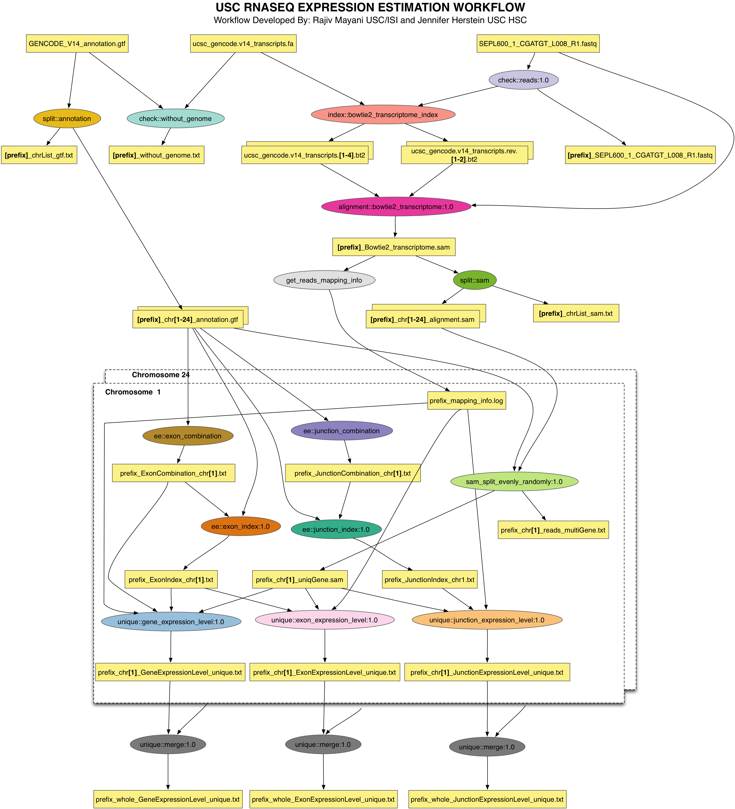

**Material by Rajiv Mayani, Jennifer Herstein, Karan Vahi**

## RNASeq Project

**@@@To be updated by Andrew and Jim@@@**

The [RSeqFlow](http://genomics.isi.edu) is an RNA-Seq analysis
pipeline, which offers an express implementation of analysis steps. It
can perform pre and post mapping quality control (QC) for sequencing
data, calculate expression levels for uniquely mapped reads, identify
differentially expressed genes, and convert file formats for ease of
visualization.  


## Introduction
Use a browser to open the tutorial on github, located at:
    http://github.com/{{page.github_username}}/{{page.bootcamp_slug}}/lessons/rnaseq/tutorial.html


A workflow is an automatic process, during which, data, information or
tasks are passed from one module to another for action, according to a
set of procedural rules. So with workflow, users can acquire analysis
results expressly saving from running the pipeline step by step,
inputting commands and arguments for each module.  As pipeline
builders, we can model, design, execute, debug, re-configure and
re-run the analysis and visualization pipelines with workflow. For
users, the workflow can not only execute a series of computational or
data manipulation steps according to presetting steps automatically,
but also enables to track the provenance of the workflow execution
results, such as, methods used, machine calibrations and parameters,
services and databases accessed, data sets used, etc. 

The Pegasus Workflow Management Service was adopted to manage the
workflow's operations. It helps workflow execute in different kinds of
different environments including desktops, campus clusters, grids, and
clouds. The Pegasus was deployed in Virtual Machine, which exempted
users from complex installation and configuration. If users want to
use their own cluster without VM, they can just use the VM as a submit
machine to submit jobs into the cluster. 

This tutorial walks through the steps of creating and running the
**Expression Estimation** Pipeline through Pegasus. The Virtual machine
has the input dataset for the tutorial workflow and all the
executables preinstalled. 

**@@@Andrew: Need information on the EE pipeline, what it does@@@.**


The schematic of the EE pipeline is shown below




All of the steps in this tutorial are performed on the
command-line. The convention we will use for command-line input and
output is to put things that you should type in bold, monospace font,
and to put the output you should get in a normal weight, monospace
font, like this:

```
    [user@host dir]$ you type this
    you get this
```

Where *[user@host dir]$* is the terminal prompt, the text you should
type is "you type this", and the output you should get is "you get
this". The terminal prompt will be abbreviated as $. Because some of
the outputs are long, we don’t always include everything. Where the
output is truncated we will add an ellipsis '...' to indicate the
omitted output. 

**If you are having trouble with this tutorial, or anything else related
to Pegasus, you can contact the Pegasus Users mailing list at
<pegasus-users@isi.edu> to get help.** 

## Getting started

In order to reduce the amount of work required to get started we have
provided several virtual machines that contain all of the software
required for this tutorial. Virtual machine images are provided for
VirtualBox. Information about starting the bootcamp VM is in the
[Virtualbox Lesson](../virtualbox/tutorial.html). Please follow the
instructions for starting the VM before continuing with this
tutorial. 


## Generating the workflow

In this tutorial, we will generating a EE workflow that runs across
chromosomes 1-22 , X, Y and M. The schema of the workflow that is
generated is the same as shown above. It takes in as input 

* fastq file
* 2 reference files, one of which is a fasta file and the other is an
  annotation file.

In the VM, the input data (451 MB) for the tutorial is present here

```
[tutorial@localhost data]$ cd /rnaseq/ee/data
[tutorial@localhost data]$ ls
GENCODE_V14_annotation.gtf  SEP034_AAGGGA_L002_R1-75Kreads.fastq  ucsc_gencode.v14_transcripts.fa
```

The workflow takes about 20-30 minutes to run in this VM.

In order to run the RSEQFLOW EE pipeline on this input dataset we need
to generate a description of the workflow that can be executed through
the workflow system. We will run the RSEQFLOW workflow generator
*expression_estimation.py* to generate this description.

The VM has a helper generate_dax.sh script that passes the right
argumetns to the workflow generator for the canned example.

```
cd /rnaseq/ee/
 ./generate_dax.sh rnaseq.dax
Generating Pegasus DAX

+ expression_estimation.py --output-prefix prefix --unique --fastq SEP034_AAGGGA_L002_R1-75Kreads.fastq --transcriptome ucsc_gencode.v14_transcripts.fa --annotation GENCODE_V14_annotation.gtf --bin-dir bin --dax rnaseq.dax --verbose
2013-09-12 20:04:10,237 - Chromosomes included X, Y, M, 1, 2, 3, 4, 5, 6, 7, 8, 9, 10, 11, 12, 13, 14, 15, 16, 17, 18, 19, 20, 21, 22
2013-09-12 20:04:10,237 - Add jobs to check input files
2013-09-12 20:04:10,238 - Add jobs to split files by chromosomes
2013-09-12 20:04:10,239 - Add jobs to build exon index and combination files
2013-09-12 20:04:10,243 - Add jobs to build junction index and combination files
2013-09-12 20:04:10,249 - Add jobs to compute unique expression level

```

In the above example, the input files to use are specified by passing
the --fastq, --annotation and --transcriptome options. You just need
to specify the basename of the input files. The --bin-dir option
specifies where all the executables required for this workflow are
installed. 

The executables referred to by this workflow are in the bin


```
[tutorial@localhost ee]$ ls -lh /rnaseq/ee/bin

bowtie2-align           GeneExpressionLevel.py
SplitByChromosome_for_transcriptomeSamFile.py
GeneExpressionLevelmappable.py
SplitByChromosome_for_transcriptomeSequenceFaFile.py
GetReadsFromTranscripts.py 
bowtie2-build           JunctionCombination.py
Merge.sh
GeneExpressionLevel_proportionAssign.py
Check_for_reference_annotation_withoutGenome.py
ModifyExonIndex.py 
....

```


Pegasus reads workflow descriptions from DAX files. The term "DAX" is
short for "Directed Acyclic Graph in XML". DAX is an XML file format
that has syntax for expressing jobs, arguments, files, and
dependencies.  Lets look at the generated DAX for the workflow


```
more rnaseq.dax 
...
```

The generated DAX has three main sections

1. The locations of the executables that are referred to by the
worklfow. These can be in a separate tranformation catalog file also.

2. The jobs making up the workflow. Notice, how the job only refer to
the input and output files by logical identifiers.

3. The edges between the jobs in the workflow that specifies the
underlying DAG ( Directed Acyclic Graph).


Note how the DAX is devoid of any data movement jobs. These are
added by Pegasus when the DAX is planned to an executable workflow.


## Running the workflow in the VM

The planning stage is where Pegasus maps the abstract DAX to one or
more execution sites. 

The pegasus-plan command is used to plan a workflow. This command
takes quite a few arguments, so we created a run_dax.sh wrapper
script that has all of the arguments required for the RSEQFlow EE
workflow: 

```
[tutorial@localhost ee]$ ./run_dax.sh rnaseq.dax
Planning Pegasus workflow

+ pegasus-plan -Dpegasus.catalog.replica.directory.site=condor_pool --dax rnaseq.dax --dir submit --conf properties --sites condor_pool --nocleanup --cluster horizontal --output-site local --input-dir data --submit
2013.09.12 21:06:13.756 EDT:   Submitting job(s). 
2013.09.12 21:06:13.795 EDT:   1 job(s) submitted to cluster 156. 
2013.09.12 21:06:13.853 EDT:    
2013.09.12 21:06:13.865 EDT:   ----------------------------------------------------------------------- 
2013.09.12 21:06:13.875 EDT:   File for submitting this DAG to Condor           : expression_estimation_prefix-0.dag.condor.sub 
2013.09.12 21:06:13.885 EDT:   Log of DAGMan debugging messages                 : expression_estimation_prefix-0.dag.dagman.out 
2013.09.12 21:06:13.895 EDT:   Log of Condor library output                     : expression_estimation_prefix-0.dag.lib.out 
2013.09.12 21:06:13.905 EDT:   Log of Condor library error messages             : expression_estimation_prefix-0.dag.lib.err 
2013.09.12 21:06:13.912 EDT:   Log of the life of condor_dagman itself          : expression_estimation_prefix-0.dag.dagman.log 
2013.09.12 21:06:13.918 EDT:    
2013.09.12 21:06:13.925 EDT:   ----------------------------------------------------------------------- 
2013.09.12 21:06:13.939 EDT:    
2013.09.12 21:06:13.949 EDT:   Your workflow has been started and is running in the base directory: 
2013.09.12 21:06:13.958 EDT:    
2013.09.12 21:06:13.965 EDT:     /rnaseq/ee/submit/tutorial/pegasus/expression_estimation_prefix/run0002 
2013.09.12 21:06:13.981 EDT:    
2013.09.12 21:06:13.995 EDT:   *** To monitor the workflow you can run *** 
2013.09.12 21:06:14.001 EDT:    
2013.09.12 21:06:14.010 EDT:     pegasus-status -l /rnaseq/ee/submit/tutorial/pegasus/expression_estimation_prefix/run0002 
2013.09.12 21:06:14.016 EDT:    
2013.09.12 21:06:14.021 EDT:   *** To remove your workflow run *** 
2013.09.12 21:06:14.053 EDT:    
2013.09.12 21:06:14.059 EDT:     pegasus-remove /rnaseq/ee/submit/tutorial/pegasus/expression_estimation_prefix/run0002 
2013.09.12 21:06:14.069 EDT:    
2013.09.12 21:06:15.369 EDT:   Time taken to execute is 5.26 seconds 

```


The script invokes the pegasus-plan command with arguments for the
configuration file (--conf), the DAX file (-d), the submit directory
(--dir), the execution site (--sites), the input directory where the
input files are (--input-dir),  the output site (-o) and (--submit) to
submit the workflow for execution. For this workflow, (--cluster)
option is also enabled that allows us to cluster the short running
jobs (unique::exon\_expression\_level,
unique::junction\_expression\_level, unique::gene\_expression\_level)
together. 


### Memory intensive jobs

For the purposes of this workshop, the basecase for the VM is to run
the tutorial in 512MB RAM. The workflow has the bowtie transcriptome
index job that requires about 4GB of RAM to create an index from the
reference files. 

Hence, for this tutorial the index files are alredy present in the
input directory.

```
[tutorial@localhost ee]$ ls -lht /rnaseq/ee/data/
total 731M
-rw-rw-r-- 1 tutorial tutorial  75M Sep 12 22:44 ucsc_gencode.v14_transcripts.rev.1.bt2
-rw-rw-r-- 1 tutorial tutorial  44M Sep 12 22:44 ucsc_gencode.v14_transcripts.rev.2.bt2
-rw-rw-r-- 1 tutorial tutorial  75M Sep 12 22:33 ucsc_gencode.v14_transcripts.1.bt2
-rw-rw-r-- 1 tutorial tutorial  44M Sep 12 22:33 ucsc_gencode.v14_transcripts.2.bt2
-rw-rw-r-- 1 tutorial tutorial 815K Sep 12 22:22 ucsc_gencode.v14_transcripts.3.bt2
-rw-rw-r-- 1 tutorial tutorial  44M Sep 12 22:22 ucsc_gencode.v14_transcripts.4.bt2
-rw-rw-r-- 1 tutorial tutorial  19M Sep 11 14:29 SEP034_AAGGGA_L002_R1-75Kreads.fastq
-rw-r--r-- 1 tutorial tutorial 243M Jun 12 16:47 GENCODE_V14_annotation.gtf
-rw-r--r-- 1 tutorial tutorial 190M Jun 12 16:47 ucsc_gencode.v14_transcripts.fa
```

The presence of the bt2 files enables Pegasus to skip the
bowtie2_transcriptome_index_ID0000003 job as the outputs for it
already exist.

When you ran rundax.sh in the log you would have seen the following:

```
2013.09.13 00:15:36.802 EDT: [INFO] event.pegasus.reduce dax.id expression_estimation_prefix_0  - STARTED 
2013.09.13 00:15:36.824 EDT: [INFO]  Nodes/Jobs Deleted from the Workflow during reduction  
2013.09.13 00:15:36.825 EDT: [INFO]  	bowtie2_transcriptome_index_ID0000003 
2013.09.13 00:15:36.825 EDT: [INFO]  Nodes/Jobs Deleted from the Workflow during reduction  - DONE 
```

Details about Pegasus Data Reuse can be found [here] (http://pegasus.isi.edu/wms/docs/latest/running_workflows.php#idp18613248).

If you want the index to be created from the reference files as part of
the workflow simply remove the .bt2 files from the  /rnaseq/ee/data/ directory.

## Monitoring the Workflow

After the workflow has been submitted you can monitor it using the
pegasus-status command: 

```
[tutorial@localhost ee]$ pegasus-status  submit/tutorial/pegasus/expression_estimation_prefix/run0001/
STAT  IN_STATE  JOB                                               
Run      10:02  expression_estimation_prefix-0                    
Run      03:28   |--without_genome_ID0000001
Idle     03:11   |--stage_out_remote_condor_pool_0_0                             
Summary: 3 Condor jobs total (I:1 R:2)

UNREADY   READY     PRE  QUEUED    POST SUCCESS FAILURE %DONE
    154       0       0       3       0       5       0   3.1
Summary: 1 DAG total (Running:1)
```

This command shows the workflow (diamond-0) and the running jobs (in
the above output it shows the two findrange jobs). It also gives
statistics on the number of jobs in each state and the percentage of
the jobs in the workflow that have finished successfully. 

Use the watch option  to continuously monitor the workflow:

```
$  pegasus-status -w submit/tutorial/pegasus/expression_estimation_prefix/run0001/
...
```

You should see all of the jobs in the workflow run one after the
other. After about 20 minutes you will see: 

```
(no matching jobs found in Condor Q)
UNREADY   READY     PRE  QUEUED    POST SUCCESS FAILURE %DONE
      0       0       0       0       0     162       0 100.0
Summary: 1 DAG total (Success:1)
```

That means the workflow is finished successfully. You can type ctrl-c
to terminate the watch command.

If the workflow finished successfully you should see the output files
in the output directory. This file was created by the various 
transformations in the workflow and shows all of the executables that
were invoked by the workflow: 

```
$ ls -lht outputs/
-rw-r--r-- 1 tutorial tutorial  111 Sep 13 01:36 outputs/prefix_whole_JunctionExpressionLevel_unique.txt
-rw-r--r-- 1 tutorial tutorial 2.1M Sep 13 01:36 outputs/prefix_whole_ExonExpressionLevel_unique.txt
-rw-r--r-- 1 tutorial tutorial 278K Sep 13 01:36 outputs/prefix_whole_GeneExpressionLevel_unique.txt
-rw-r--r-- 1 tutorial tutorial    0 Sep 13 01:28 outputs/prefix_without_genome.txt
-rw-r--r-- 1 tutorial tutorial   29 Sep 13 01:27 outputs/prefix_SEP034_AAGGGA_L002_R1-75Kreads.fastq
```

Of these the first three files (with prefix prefix_whole_) will be of
interest to the scientists.

## Collecting Statistics

The pegasus-statistics command can be used to gather statistics about
the runtime of the workflow and its jobs. The -s all argument tells
the program to generate all statistics it knows how to calculate: 

```
[tutorial@localhost ee]$ pegasus-statistics -s all submit/tutorial/pegasus/expression_estimation_prefix/run0001/

#
# Pegasus Workflow Management System - http://pegasus.isi.edu
#
# Workflow summary:
#   Summary of the workflow execution. It shows total
#   tasks/jobs/sub workflows run, how many succeeded/failed etc.
#   In case of hierarchical workflow the calculation shows the
#   statistics across all the sub workflows.It shows the following
#   statistics about tasks, jobs and sub workflows.
#     * Succeeded - total count of succeeded tasks/jobs/sub workflows.
#     * Failed - total count of failed tasks/jobs/sub workflows.
#     * Incomplete - total count of tasks/jobs/sub workflows that are
#       not in succeeded or failed state. This includes all the jobs
#       that are not submitted, submitted but not completed etc. This
#       is calculated as  difference between 'total' count and sum of
#       'succeeded' and 'failed' count.
#     * Total - total count of tasks/jobs/sub workflows.
#     * Retries - total retry count of tasks/jobs/sub workflows.
#     * Total+Retries - total count of tasks/jobs/sub workflows executed
#       during workflow run. This is the cumulative of retries,
#       succeeded and failed count.
# Workflow wall time:
#   The walltime from the start of the workflow execution to the end as
#   reported by the DAGMAN.In case of rescue dag the value is the
#   cumulative of all retries.
# Workflow cumulative job wall time:
#   The sum of the walltime of all jobs as reported by kickstart.
#   In case of job retries the value is the cumulative of all retries.
#   For workflows having sub workflow jobs (i.e SUBDAG and SUBDAX jobs),
#   the walltime value includes jobs from the sub workflows as well.
# Cumulative job walltime as seen from submit side:
#   The sum of the walltime of all jobs as reported by DAGMan.
#   This is similar to the regular cumulative job walltime, but includes
#   job management overhead and delays. In case of job retries the value
#   is the cumulative of all retries. For workflows having sub workflow
#   jobs (i.e SUBDAG and SUBDAX jobs), the walltime value includes jobs
#   from the sub workflows as well.
------------------------------------------------------------------------------
Type           Succeeded Failed  Incomplete  Total     Retries   Total+Retries
Tasks          209       0       0           209       0         209          
Jobs           161       0       0           161       0         161          
Sub-Workflows  0         0       0           0         0         0            
------------------------------------------------------------------------------

Workflow wall time                               : 11 mins, 18 secs
Workflow cumulative job wall time                : 7 mins, 22 secs
Cumulative job walltime as seen from submit side : 8 mins, 43 secs

Summary                       : submit/tutorial/pegasus/expression_estimation_prefix/run0001/statistics/summary.txt
Workflow execution statistics : submit/tutorial/pegasus/expression_estimation_prefix/run0001/statistics/workflow.txt
Job instance statistics       : submit/tutorial/pegasus/expression_estimation_prefix/run0001/statistics/jobs.txt
Transformation statistics     : submit/tutorial/pegasus/expression_estimation_prefix/run0001/statistics/breakdown.txt
Time statistics               : submit/tutorial/pegasus/expression_estimation_prefix/run0001/statistics/time.txt
```

Note: If the memory intensive job had been enabled, the walltime would
be much longer.

## Conclusion
Congratulations! You have completed the tutorial. For more information
on the pipeline, please contact 


Please contact the Pegasus Users Mailing list at
<rseqflow@isi.edu> if you need help. 

