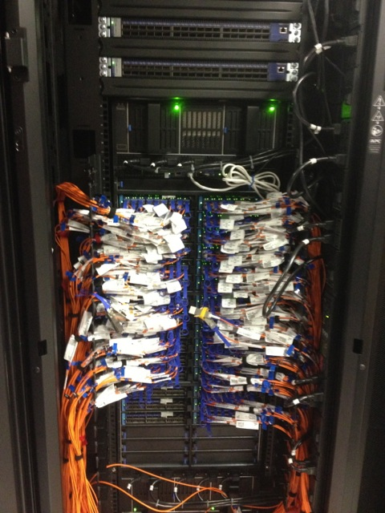

**Material by John Mehringer**



##Storage
###User and Project Filesystems
All accounts are provided with user and project directory storage which is mounted via NFS to both head and compute nodes.  All data on these NFS servers are backed up to tape daily and we keep a couple days worth of copies which means we can usually recover deleted data if it is older than a day and we are informed about it as soon as possible. 

User directories can hold up to 1GB which is fixed and cannot be increased.  The best place to store your data is in a project directory which can hold up to 1TB. When addressing the NFS filesystems in scripts, please use the /home/rcf-XX/projectid path and not /auto or /export because at times we have to move data to different systems and the /home paths are guaranteed to always work.  You can view your filesystem quotas and disk usage at the [check your quota webpage](http://hpcc.usc.edu/support/accounts/checking-your-quotas/).  

###Temporary Job Storage
####/scratch
All running jobs have a /scratch parallel filesystem available to them which is created using the compute nodes running that job.  If a processes writes to a file stored under /scratch, processes on all other nodes can see and access that data.  Accessing data from /scratch can be much faster than from the NFS project directory because it dedicated to the running job and stored in parallel across the nodes. Jobs running on large numbers of nodes can overload an NFS fileserver if they all access data at the same time. For a shared dataset, it can be faster to copy it from your project directory  to /scratch, process the data and then copy back the results from /scratch to the project directory. At the end of a job, however, all data on /scratch is deleted so it is important to remember to copy the results back at the end and/or periodically copy them over to the project filesystem.  

####/staging
At the end of September, we are adding a new /staging filesystem to the cluster in order to support users who have temporary datasets which need to be accessed by multiple jobs.  /staging is a parallel filesystem built using the same software (orangefs) as /scratch but it is hosted on dedicated storage machines not running any jobs. Each project will have a directory under /staging in which to store data on a temporary basis.  This filesystem will never be backed up so it is very important that results are copied to a NFS based project filesystem for safe keeping.  Also, /staging will be wiped and rebuilt during the twice yearly cluster downtimes.   

###Files and Performance 
Directories with thousands to millions of small files in them can result in slow performance.  When trying to access one of these files, the operating system will have to search through the metadata for all files in that directory which slows down file access.  Also, linux will prefetch data within a file in expectation that the application using it will be requesting more soon.  By storing data into less but larger files, your application will see much faster data access speeds.  If you have lots of small pieces of data, consider storing them into a database and maybe loading and dumping that data with each job run.  

##Software
A sizeable amount of software is included by default in the CentOS 6 linux distribution.  CentOS is a free linux distribution which is built to be fully compatible with Redhat Enterprise Linux (RHEL). Additional software can also be found in the /usr/usc environment.  We add software to this environment by request if it is of use to multple members of the HPCC community.  Project specific software should be stored in your project directory.

To use a specific /usr/usc software package you need to source a shell specifc setup file (setup.sh or setup.csh) in any PBS job related scripts or within your login if you want to it them interactively.

List of current /usr/usc software packages

```
amber		fdtd		iperf		mpich-mx	R
bbcp		fftw		jdk		mvapich2	sas
bin		gaussian	lammps		NAMD		schrodinger
boost		globus		magma		nwdb		spss
conf		gnu		mathematica	openmpi		stata
cuda		gromacs		matlab		petsc		subversion
cula		hadoop		mkl		pgi		taxila
dict		hdfview		mpich		python		tdk
etc		intel		mpich2		qespresso
```

Each /usr/usc package can contain multiple versions.  We have created "default" and "new" symlinks for most packages which point to the recommended version and the most current version respectively. Going forward, these symlinks will be updated during each cluster downtime.

```
[jmehring@hpc-login2 R]$ ls -l /usr/usc/R
total 20
drwxr-xr-x 5 bin  bin  4096 Jan 14  2013 2.13.0
drwxr-xr-x 5 bin  bin  4096 Feb  3  2012 2.14.1
drwxr-xr-x 5 root root 4096 Jan 18  2013 2.15.2
drwxr-xr-x 5 bin  bin  4096 Sep 12 14:10 3.0.1
lrwxrwxrwx 1 bin  bin     6 Mar  6  2012 default -> 2.13.0
lrwxrwxrwx 1 bin  bin     6 Mar  6  2012 new -> 2.14.1
```


##Check Pointing and Job Recovery
The USC HPCC clusters are built from many commodity servers and parts of them do fail from time to time.  Jobs are most reliable when they can be restarted from a given point after a failure occurrs. Try breaking your problem into smaller pieces so that when a failure happens not too much processing is lost and recovery can be done more easily.  Also, think about ways in which your job can save its state every few hours for recovery purposes. For example, if you are processing sets of files, think about having separate directories for files which need to be processed, are in the middle of processing, and completed.  


##Support
If you are having any problems with running a job or jobs are running slow, feel free to email hpcc@usc.edu for assitance.  Please include the job id and any received error messages or log output with your email.  If a job is stuck in the queue, please do not delete it.  Once a job has been removed from the queue, the scheduler deletes most information related to that job.

Please see our [website](http://hpcc.usc.edu) for announcements and additional documentation. 
[http://hpcc.usc.edu](http://hpcc.usc.edu) 

We also have [workshops](http://hpcc.usc.edu/support/hpcc-computing-workshops/) on topics useful to the USC HPCC user community. 

---
[Overview](overview.html) -- [Running a Job](running-a-job.html) -- **Best Practices**
