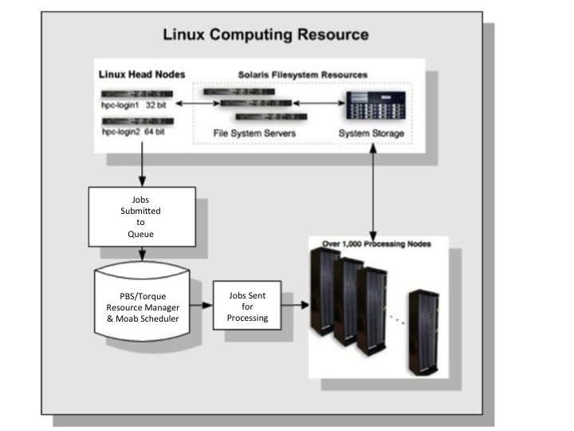
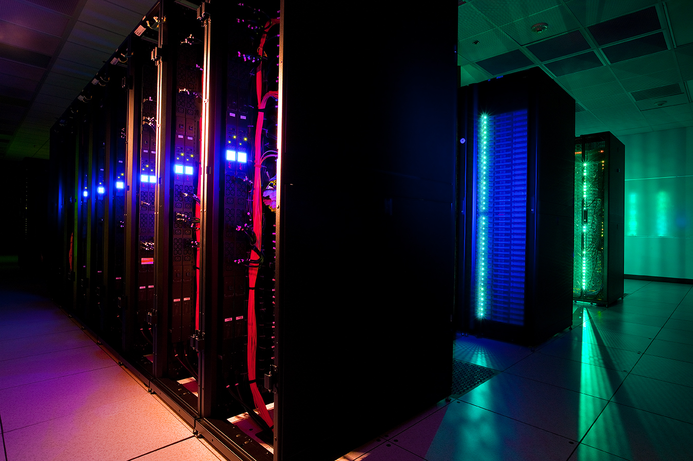

**Material by John Mehringer**

##Overview 

USC's [HPCC] (http://hpcc.usc.edu) consists of a diverse mix of computing, network and data storage resources. Two Linux clusters constitute the principal computing resource and each is backed by a high speed low latency interconnect. HPCC has a central facility that provides more than 1.4 petabytes of combined disk storage and potential access to multiple petabytes of tape storage.  The clusters have multiple 10 gigabit interfaces to the USC campus network.  In addition, HPCC is home to the headquarters of Los Nettos a regional network operator within Los Angeles County.  We have recently deployed a 100 gigabit connection which allows for high speed connections to various wide area research networks such as Cenic, Internet2, and Pacific Wave. 

##Access 
HPCC is a freely available resource for all USC Faculty and Students. To apply for an account, fill out our [allocation request form](http://hpcc.usc.edu/support/accounts/applying-for-a-hpcc-account/) using your USC login.  Resource allocations can be shared among a group of researchers.  Cluster compute time is allocated in cpu core hours and free storage is available up to 1TB total per project.

If you need more resources that what is available with the free offering, dedicated nodes can be purchased and housed within the HPCC cluster (condoing).  Dedicated nodes are sold at cost to the research group and include with 3 years of support.  After 3 years nodes can continue to be used but if they suffer a hardware failure or space is needed then they are decommissioned.  Additional dedicated storage can be purchased for a project (usually at a minimum of 15TB) or storage can be rented from the [USC Digital Repository](http://repository.usc.edu). 
 

##Cluster Specifications:

**Infinband Cluster**

+ 5th fastest super computer in US Academia (June 2013) 
+ 53rd fastest in the world
+ 264 HP sl250s
  - 16 cpu cores
  - 64 GB of RAM
  - 2 NVIDIA K20 Kepler GPU Accelerators
  - 1 TB local temporary disk
  - 56.6 Gbps Infiniband Backbone
+ 208 HP sl230s (in 2 weeks)
  - Same as above but no GPUs
  - increased to 128 GB of RAM

**Myrinet Cluster**

+ 13th fastest super computer in US Academia (Jun 2013) 
+ 243rd fastest in the world
+ 5 Generations of hardware
+ 2185 machines
+ Oldest: 8 cpu cores, 12GB RAM 
+ Newest: 24 cpu cores, 48GB RAM 

