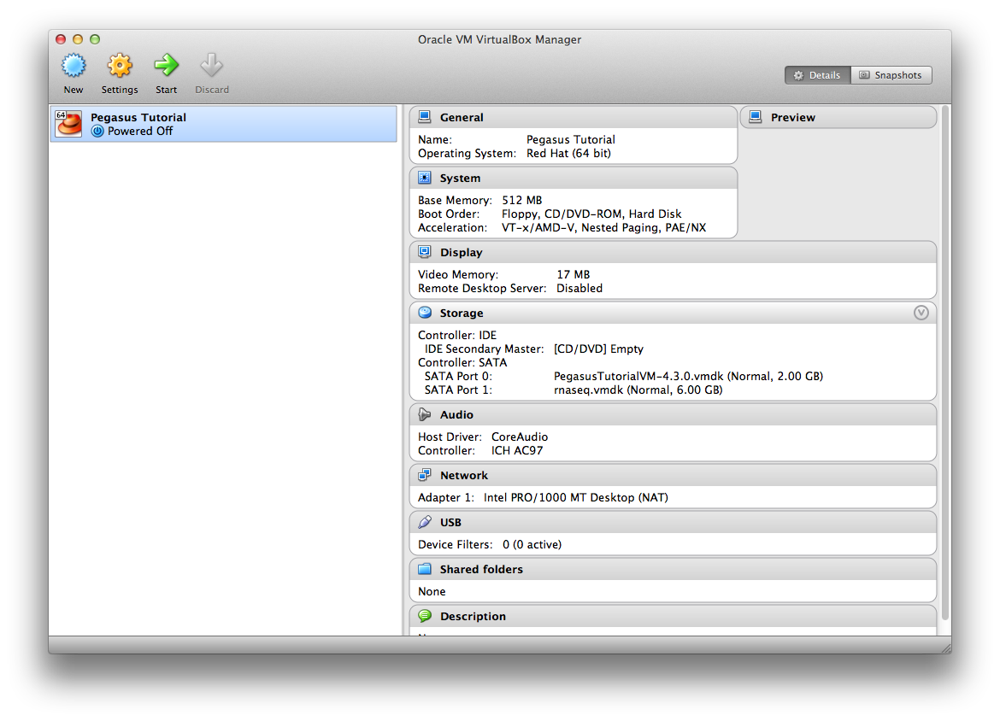

**Material by Karan Vahi and Gideon Juve**

## Introduction
This appendix provides information on how to launch the Bootcamp
Tutorial VM. The VM is a quick way to get started using Pegasus. It
comes pre-configured with Pegasus, DAGMan and Condor so that you can
begin running workflows immediately. 

Additionally, the VM also has the following installed:

* git
* python
* ipython
* numpy
* scipy
* matplotlib
* nose
* rnaseq workflow module

In the following sections we will cover how to start, log into, and
stop the tutorial VM locally, using the VirtualBox virtualization
software. 

VirtualBox is a free desktop virtual machine manager. You can use it
to run the Pegasus Tutorial VM on your desktop or laptop. 

## Install VirtualBox

First, download and install the VirtualBox platform package from the
VirtualBox website: https://www.virtualbox.org 

## Download VM Image

Next, download the bootcamp tutorial VM from the Pegasus download
page: 

http://pegasus.isi.edu/downloads

Or you can copy the VM image from the USB stick that you got.

Unzip the downloaded file and move the .vmdk file it contains to
somewhere that you can find it later. 

## Create Virtual Machine
Start VirtualBox. You should get a screen that looks like this:


Click on the "New" button. The "Create New Virtual Machine Wizard"
will appear: 


Click "Continue" to get to the VM Name and OS Type step:


In the Name field type "Pegasus Tutorial". Set the Operating System to
"Linux" and the Version to "Red Hat (64 bit)". 

*Warning*
Make sure to select "Red Hat (64 bit)" as the Version. If this is
incorrect the virtual machine may not be able to start.

Click "Continue" to get to the Memory step. You can leave this at the
default of 512 MB. 


Click "Continue" again to get to the "Virtual Hard Disk" step:


Choose "Use existing hard disk". Click
the folder icon and locate the .vmdk file that you downloaded
earlier and click OK. You will see now a rnaseq.vmdk under the SATA
controller. Click OK.


When you have selected the .vmdk file, choose "Open" and then click
"Create" . You will get back to the welcome screen showing the
new virtual machine:


Before Starting the VM we need to attach the RNASeq disk to the VM.
Click on the Settings Cog Icon to goto the settings page for the
Pegasus Tutorial VM. Click the Storage Tab. 


There select the SATA Controller and click on add harddisk
icon. Choose existing disk and select the choose existing disk, and
select rnaseq.vmdk from the VM folder.

**Note:  The VM won't start if you don't attach the rnaseq disk.**


You will now see the rnaseq disk attached to the SATA controller.


Click OK and you will get back to main Virtual Box Manager window,
where you can see under storage the rnaseq.vmdk attached for the
Pegasus Tutorial under the Storage setting.




Click on the name of the virtual machine and then click "Start". After
a few seconds you should get to the login screen: 


Log in as user *tutorial* with password *pegasus*.

After you log in you can return to the lessons and complete the bootcamp.

## Terminating the VM
When you are done with the tutorial you can shut down the VM by
typing: 

```
$ sudo /sbin/poweroff
at the prompt and then enter the tutorial user's password.
``

Alternatively, you can just close the window and choose "Power off the
machine".
